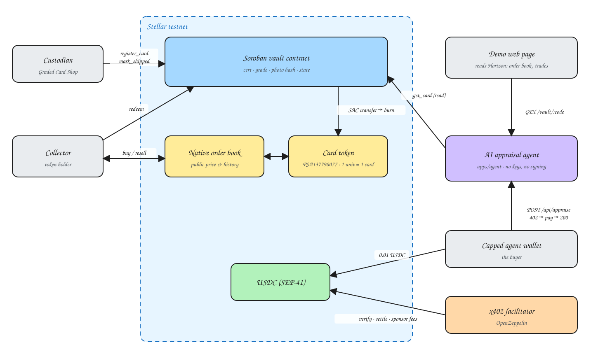

# Card Place — The first secure card exchange

**English** · [Français](README.fr.md)

**A secure exchange to invest in trading cards the way you invest in a stock**: an order book, a public price, sales history on the blockchain, charts, authentication at the core, and the option to leave the card in a vault, so the item can be sold many times while staying in the same place.

## The problem

To buy a stock or a crypto today, you can choose between several secure platforms. The spread is tight, the price is the same at every broker, you get charts and a clear history, you decide with full information, and one click makes you the owner.

Trading cards have become a real investment, and the market is growing fast.

I am a collector, and I am also Lothin, co-founder of [Graded Card Shop](https://gradedcardshop.fr): we buy and sell graded cards. We opened in February; we have now sold €53,000 worth of cards, with no advertising, only by listing on platforms like Vinted and eBay.

Even before selling professionally, I saw it as a collector. This market suffers from four problems:

1. **Opaque prices.** There is no public reference price. Sales happen privately, on platforms that don't publish their history clearly, with gaps of sometimes 10% between two platforms for the same card. The buyer doesn't know if they are paying a fair price; the seller doesn't know if they are underselling.
2. **The card's condition.** Condition drives price: a card in poor shape isn't worth what a card in good shape is. Grading is subjective, depending on the buyer or the seller. Scams and deliberately hidden defects are common, and no organisation validates the condition of a raw card.
3. **Counterfeits.** Fake cards, but also resealed slabs and cards retouched with AI. Scams are widespread: every transaction means trusting a stranger again.
4. **Shipping and storage.** Insurance doesn't always cover theft in transit. Cards get damaged on the way because they are badly packed, from lack of practice or knowledge. Burglaries targeting card collectors specifically are also on the rise.

**Card Place targets all cards, but starts with graded cards.** They are already authenticated and graded by a third party (PSA, PCA, BGS), sealed in a slab, and identified by a unique certificate number. Their price is more liquid and their condition is frozen. It is the easiest market to secure, and the natural entry point before extending authentication to raw cards.

## What the project does

<p align="center">
  
</p>

The marketplace connects buyers and sellers, with optional authentication of the item if the buyer asks for it, and clear procedures for each party so the transaction goes smoothly. A safer marketplace, where you can pay in fiat or in crypto on the Stellar blockchain (XLM, USDC).

Card Place acts as **escrow**: the buyer's money is locked until the card has arrived and been checked, and the card only ships once the money is locked. Neither buyer nor seller has to trust the other.

The marketplace provides reliable data so users can make better investment decisions: a ranking of the most traded cards right now, across all TCGs, and key information such as sales history, reference price and performance chart.

Sellers can deposit their card in a vault. It is then represented by **a native Stellar asset** (code = certificate number, 1 unit issued). The token trades on the native order book in 5 seconds for a fraction of a cent, which makes transactions safer and easier. The physical card only travels once: when the final holder calls `redeem()`, returns the token and receives the card.

**Demo line:** three pillars carry every trade: a Soroban smart contract that holds the card in the vault and locks the money in escrow; x402 on Stellar so services get paid per call in USDC; and AI where it helps, a coding agent to build and deploy the contract and an appraisal agent paid per call, never in transaction validation, which stays deterministic code.

### The user journey

Buyer side:

1. I want to buy a card: I pay in fiat or crypto. My money is locked in escrow.
2. I can negotiate the seller's asking price.
3. I choose to have the card shipped to me, or to request an appraisal and turn the asset, secured in our vault, into a Stellar token.
4. When the card has arrived and been checked, escrow releases the payment to the seller.

Seller side:

1. I list my card at the price I want, then accept or reject buyers' offers.
2. I only ship once the money is locked in escrow.
3. If I deposit my card in the vault, it becomes a token: I can resell it without shipping it, as many times as I like.

### The product: a data-driven marketplace

Every screen relies on data the chain makes public and verifiable:

| Screen | What it shows | Where the data comes from |
|---|---|---|
| Identity card | set, expansion, number, rarity, grader, certificate, grade, photo | the contract's on-chain record + the photo hash |
| Reference price, bid vs ask | best bid, best ask, spread | the native Stellar order book, public |
| Sales history | every trade, price, date, grade | the token's transactions on the ledger, readable by anyone |
| Performance chart | price over 7 d, 1 m, 1 y | the same history, aggregated |
| Market stats | low, high, 30-day volume, number of sales | same |
| Trust score | certificate checked with the grader, label / record / photo consistency, visible condition | the AI appraisal agent, paid per call |

### Security, concretely

- **Escrow.** The buyer's USDC is locked in a contract, not with the seller or with Card Place. Release and refund follow rules written in the contract: buyer confirmation, confirmed delivery, timeout. A program with no AI listens to the carrier and on-chain events and triggers those rules.
- **No AI in transaction validation.** Validating a payment, releasing escrow, burning a token: that is deterministic, tested, readable code. Adding an AI layer on financial data would add risk, not security. AI is used elsewhere: to build and deploy the contract (a coding agent connected to Raven, Stellar's MCP server, guided by `AGENTS.md`), and to appraise a card, an information service paid per call that never touches funds.
- **Only the custodian can create the token.** The asset is issued by the vault account. A card that isn't physically in the vault has no token, so it can't be sold as such. A fake, a stolen photo or a resealed slab produce nothing.
- **Authentication is physical, at vault intake.** The custodian examines the card and its slab, and checks the certificate number against the grader's public database. The token is only issued after that.
- **The reference photo is taken by the custodian**, not supplied by the seller. Its on-chain hash guarantees nobody can swap the photo afterwards. That is record integrity, not authentication.
- **The AI agent identifies the card; it does not replace physical authentication.** It cross-checks three sources: the grader's public record (PSA and PCA publish every certificate by number), the slab label read from the photo, and the on-chain record. If all three agree, the card is identified and it rates the visible condition. If any one diverges, a human reviews it.
- **The chain makes the record tamper-proof; physical security depends on the custodian's process.** That is true of StockX too. A physical fingerprint of the card is the next building block, described at the end of this document.

## Under the hood: what runs on testnet today

One complete on-chain journey, executed with a real card from our stock:

1. The custodian authenticates the card, puts it in the vault and registers it on-chain: certificate, grade, SHA-256 hash of the photo. → `register_card`
2. The token moves freely: payments, order book, trustline = the receiver's consent.
3. An AI agent, paid per call in USDC via **x402 on Stellar**, checks that the photo is the one in the contract, reads the slab label, compares it with the on-chain record and the certificate published by the grader, and rates the condition.
4. The holder returns the token and requests the card. → `redeem` (the SAC burns the token)
5. The custodian confirms shipping with the tracking number. → `mark_shipped`

## Why Stellar

Replace Stellar with a database and you need a trusted intermediary to hold balances and publish prices, plus settlement delays and fees on every resale. On Stellar:

- **A token is not a contract.** One card = code + issuer, 1 unit. Issuing takes two transactions.
- **The market is already in the protocol.** The native order book trades the card against XLM or USDC with no marketplace code, and it is public: the end of opaque prices.
- **Every sale is a public transaction.** A card's price history can be verified by anyone, without depending on the platform.
- **The trade is atomic.** Token against USDC in a single transaction: both legs settle or neither does. Escrow is only needed for physical movements.
- **A trustline is consent.** Nobody receives a card without having accepted it.
- **Fees make a €10 card viable**, which is economically impossible elsewhere.
- **Fiat goes in and out through anchors** (SEP-24, MoneyGram): the buyer pays in euros, the ledger settles in USDC.
- **x402 on Stellar** lets agents pay in the same currency as collectors, with fees sponsored by the facilitator.

The contract only does what the protocol can't: bind the token to the certificate, track the physical state, and handle redemption.

To be honest: [StockX](https://stockx.com) proved the order book + authentication model for sneakers, without a blockchain. [Courtyard](https://courtyard.io) tokenises PSA cards on Polygon. Card Place's angle is the European niche (PCA, PSA FR), a seller who is also the custodian, low-priced cards that fees exclude elsewhere, and the public price as the product. x402 also exists on other chains.

## Architecture

<p align="center">
  
</p>

Source: [`docs/architecture.excalidraw`](docs/architecture.excalidraw), editable at [excalidraw.com](https://excalidraw.com) (Open → select the file).

How to read it: the custodian writes the record, the market lives on the native order book, the agent reads the record and gets paid in USDC, and `redeem` burns the token and triggers shipping.

## Technical specs

### Contract `contracts/vault` (Rust, `soroban-sdk` 28, target `wasm32v1-none`)

| Function | Auth | Inputs | Output | Effect |
|---|---|---|---|---|
| `__constructor(custodian)` | deployment | `Address` | — | sets the custodian (instance storage) |
| `custodian()` | none | — | `Address` | read |
| `register_card(asset_code, token, grader, cert, grade, description, photo_hash)` | custodian | `Symbol, Address, Symbol, Symbol, u32, String, BytesN<32>` | `Result<(), Error>` | creates the record, state `InVault`. Error `CardAlreadyRegistered` (1) |
| `redeem(holder, asset_code)` | holder | `Address, Symbol` | `Result<(), Error>` | transfers 1 unit of the token (SAC) to the custodian, state `RedeemRequested`. Errors `CardNotFound` (2), `InvalidStatus` (3) |
| `mark_shipped(asset_code, tracking)` | custodian | `Symbol, String` | `Result<(), Error>` | state `Shipped`, stores tracking. Error `InvalidStatus` if not `RedeemRequested` |
| `get_card(asset_code)` | none | `Symbol` | `Result<Card, Error>` | public read |

**Storage.** `Custodian` in *instance*. Each `Card(asset_code)` in *persistent*, TTL extended on every write (threshold 30 days, target 1 year). No `Vec` and no loops: constant cost per call.

**`Card` record.** `token` (SAC address), `grader`, `cert`, `grade`, `description`, `photo_hash` (SHA-256 of the front), `status`, `redeemer: Option<Address>`, `tracking: Option<String>`, `registered_at` (ledger).

**Security.** Strict transitions `InVault → RedeemRequested → Shipped`. `redeem` requires the holder's auth, which covers the SAC `transfer` sub-call: nobody can return someone else's token. If the holder doesn't own the token, the transfer fails and nothing changes. 11 unit tests cover the full cycle and every rejection.

### Agent `apps/agent` (Node 22, ESM, Express 5)

| Route | Price | Role |
|---|---|---|
| `GET /health` | free | service status |
| `GET /vault/:asset_code` | free | on-chain record, read through RPC simulation |
| `POST /api/appraise` `{ asset_code }` | 0.01 USDC via x402 | reads the record, checks the photo fingerprint; Claude reads the label, compares it with the record and the grader's certificate, rates the condition and estimates value. Looking up the certificate with the grader (PSA API, PCA page) is planned for Lisbon |

One module per responsibility: `config.js` (environment), `vault.js` (contract reads), `photos.js` (SHA-256), `appraise.js` (Claude, schema-structured output), `paywall.js` (x402 Stellar), `payer.js` (capped agent wallet), `server.js` (routes).

**x402 on Stellar.** `@x402/express` + `@x402/stellar`, testnet facilitator hosted by OpenZeppelin, network `stellar:testnet`, SEP-41 USDC asset. The client signs a Soroban authorization entry; the facilitator rebuilds the transaction, sponsors the fees and settles. The client refuses to sign above the `AGENT_MAX_USD_PER_PAYMENT` cap.

**The AI agent holds no Stellar key and signs no transaction.** It proposes; the holder and the custodian decide.

## Deployed on testnet

| What | Address / transaction |
|---|---|
| Custodian and deployer | [`GBNZP4YND7GXOM26YNBOAXIMTEMKNHDX7CQ5VZOJ3VKW7HDJSQR3XK75`](https://stellar.expert/explorer/testnet/account/GBNZP4YND7GXOM26YNBOAXIMTEMKNHDX7CQ5VZOJ3VKW7HDJSQR3XK75) |
| **Vault contract** | [`CDN5OOWTOYKEXMH5CDG7APQRQEHGFRKWQEAHQR5XR3643YOM2YEMEMRO`](https://stellar.expert/explorer/testnet/contract/CDN5OOWTOYKEXMH5CDG7APQRQEHGFRKWQEAHQR5XR3643YOM2YEMEMRO) |
| Deployment | [`5833d9…978d1`](https://stellar.expert/explorer/testnet/tx/5833d98dd4230adee7f78feb8b34dcf8d8a190cb453c7b0dbf224c1ab25978d1) |
| Card asset `PSA137798077` (SAC) | [`CASKFD5AFFRLUEW6YJUQRSTXJ7MQU7ZMUCMW254G4CR5QJ45Q5DYNVKH`](https://stellar.expert/explorer/testnet/contract/CASKFD5AFFRLUEW6YJUQRSTXJ7MQU7ZMUCMW254G4CR5QJ45Q5DYNVKH) |
| Collector (holder) | [`GCR6HZKROPDQY3KZBSC27KKYEB7RAJRDWEIEUQYIXHUA6D6WOVXTWVHH`](https://stellar.expert/explorer/testnet/account/GCR6HZKROPDQY3KZBSC27KKYEB7RAJRDWEIEUQYIXHUA6D6WOVXTWVHH) |
| `register_card` (custodian) | [`246cf5…6d32c`](https://stellar.expert/explorer/testnet/tx/246cf5ebeebd77fe2176ef1fa584334a9c6f0e0387e8eed37d45a8ed7526d32c) |
| `redeem` (collector, SAC `burn` event) | [`fb6a62…8977a`](https://stellar.expert/explorer/testnet/tx/fb6a6235c2cac014ed0e1e846945e1cf5b574b25458ba55e0e9946e0e398977a) |
| `mark_shipped` (custodian) | [`342db4…5ed3cf`](https://stellar.expert/explorer/testnet/tx/342db414c65cf3bf04648dde4fd87a280d883b2644c287fd64b733ada25ed3cf) |
| x402 payment settled by the facilitator | [`4709b9…763c4`](https://stellar.expert/explorer/testnet/tx/4709b937d086eef100fe09bc760bde81f9d84887a7fff12f14beec9268e763c4) |

The SHA-256 of `docs/psa-137798077-front.jpg` is `e274a654…0abfa`, stored on-chain.

## Reproduce

Prerequisites: Rust + the `wasm32v1-none` target, [Stellar CLI](https://developers.stellar.org/docs/tools/cli) 28, Node 22, a funded testnet identity (`stellar keys generate moi --network testnet --fund`).

### 1. Contract

```sh
cargo test                                   # 11 tests
stellar contract build                       # target/wasm32v1-none/release/card_vault.wasm

MOI=$(stellar keys address moi)
stellar contract deploy \
  --wasm target/wasm32v1-none/release/card_vault.wasm \
  --source-account moi --network testnet --alias vault \
  -- --custodian "$MOI"
```

### 2. The card: a native asset, a SAC, a holder

```sh
stellar keys generate collectionneur --network testnet --fund
COL=$(stellar keys address collectionneur)

stellar tx new change-trust --source-account collectionneur --line "PSA137798077:$MOI" --network testnet
stellar tx new payment --source-account moi --destination "$COL" \
  --asset "PSA137798077:$MOI" --amount 10000000 --network testnet          # 1 unit = 1 card
stellar contract asset deploy --asset "PSA137798077:$MOI" --source-account moi --network testnet --alias card_psa137798077
```

### 3. The full on-chain cycle

```sh
# the custodian registers the card (hash = sha256 of docs/psa-137798077-front.jpg)
stellar contract invoke --id vault --source-account moi --network testnet --send=yes -- \
  register_card --asset_code PSA137798077 --token CASKFD5AFFRLUEW6YJUQRSTXJ7MQU7ZMUCMW254G4CR5QJ45Q5DYNVKH \
  --grader PSA --cert '"137798077"' --grade 10 \
  --description '"2025 Pokemon BLK FR Zekrom ex #166 Special Illustration Rare"' \
  --photo_hash e274a6542ed20a6121176b169f09bf56c8a58ea62653109a9d553aa073a0abfa

# the collector returns the token and requests shipping
stellar contract invoke --id vault --source-account collectionneur --network testnet --send=yes -- \
  redeem --holder "$COL" --asset_code PSA137798077

# the custodian confirms shipping
stellar contract invoke --id vault --source-account moi --network testnet --send=yes -- \
  mark_shipped --asset_code PSA137798077 --tracking '"LA123456789FR"'

# public read
stellar contract invoke --id vault --source-account moi --network testnet -- get_card --asset_code PSA137798077
```

Without `--send=yes`, the call is only simulated and never reaches the ledger.

### 4. The AI agent and the x402 API

```sh
cd apps/agent
npm install
cp .env.example .env     # VAULT_CONTRACT_ID, X402_PAY_TO, X402_FACILITATOR_API_KEY, ANTHROPIC_API_KEY, AGENT_SECRET_KEY
```

- Free testnet facilitator key: `curl https://channels.openzeppelin.com/testnet/gen`
- The paying account needs a USDC trustline (`stellar tx new change-trust --line USDC:GBBD47IF6LWK7P7MDEVSCWR7DPUWV3NY3DTQEVFL4NAT4AQH3ZLLFLA5`) and some testnet USDC ([Circle faucet](https://faucet.circle.com), Stellar network).

```sh
node scripts/x402-smoke.mjs                       # real x402 payment, no AI: 402 → 200 + receipt
npm start                                         # server on :3000
curl localhost:3000/vault/PSA137798077            # free
node scripts/pay-and-appraise.mjs PSA137798077    # the agent pays 0.01 USDC and receives the appraisal
```

To test paying in XLM instead of USDC (no faucet needed), on the server side set `X402_ASSET=CDLZFC3SYJYDZT7K67VZ75HPJVIEUVNIXF47ZG2FB2RMQQVU2HHGCYSC X402_AMOUNT=1000000` and on the client side `AGENT_ALLOWED_ASSET=<same address> AGENT_ALLOWED_ASSET_MAX=5000000`.

### 5. The card page (marketplace)

A plain HTML page with no framework and no build step, in `demo-web-page/`, run locally: category menu and market cap ranking, Zekrom card page with front/back, sales history with chart, rarity, recent sales, card record read from the contract, live buy price from the Stellar order book.

```sh
node demo-web-page/serve.mjs                           # http://localhost:8080/demo-web-page/
sh demo-web-page/seed-market.sh                        # places a sell order and a buy order on the Stellar DEX
```

- The **card record** is read live through the agent (`GET /vault/:code`), started with `npm start` in `apps/agent`.
- The **buy price** on the Buy now button and the **token's transactions** are read live from Horizon, Stellar's public API, for the `PSA137798077 / XLM` pair.
- Sales history, population, the market table and the market cap ranking are demo data in `demo-web-page/data/`. Ranking images come from TCGdex, pokemontcg.io and the Bulbagarden archives.

## What is real, what remains

| In this repo, verified on testnet | At HackMeridian |
|---|---|
| Vault contract deployed, full cycle registered → returned → shipped with a real card | The connected marketplace: buy and sell from the page, sales history indexed from the token's transactions |
| Card page (`demo-web-page`): on-chain record and order book read live, chart, population, trust score | Several cards, connected wallet (Freighter), fiat payment through an anchor |
| Card = native asset + SAC, token burned on `redeem` | Several real cards from our stock, live trading on the order book |
| x402 payment on Stellar settled on-chain by the facilitator | **The escrow contract**: `open` locks the buyer's USDC, `release` pays the seller, `refund` reimburses after a timeout or dispute |
| AI appraisal agent: on-chain read, SHA-256 check, structured output. Contract and tests built with a coding agent connected to Raven | **The monitoring program, no AI**: listens to the carrier and on-chain events, triggers `release` or `refund` according to the contract rules; disputes go to a human |
| Capped agent wallet on the client side | The agent that buys for a collector within their spending limit; 30-second video as a fallback |

Next: a physical fingerprint of the card (high-resolution scan under fixed lighting, hash on-chain, re-scan on exit) or a tamper-proof NFC seal on the slab, then raw cards through the authentication and grading service at vault intake, and fiat through Stellar anchors.

## Structure

```
contracts/vault/src/lib.rs    # the vault contract, ~150 commented lines
contracts/vault/src/test.rs   # 11 tests
apps/agent/src/               # config, vault, photos, appraise, paywall, payer, server
apps/agent/scripts/           # x402-smoke.mjs, pay-and-appraise.mjs
demo-web-page/                     # single page: index.html, styles.css, app.js, data/, img/, serve.mjs, seed-market.sh
docs/                         # reference photos of the card, architecture diagram (.excalidraw + .svg)
README.fr.md                  # this README in French
VISION.md                     # the hackathon vision (2000 characters)
AGENTS.md                     # context for coding agents
```
