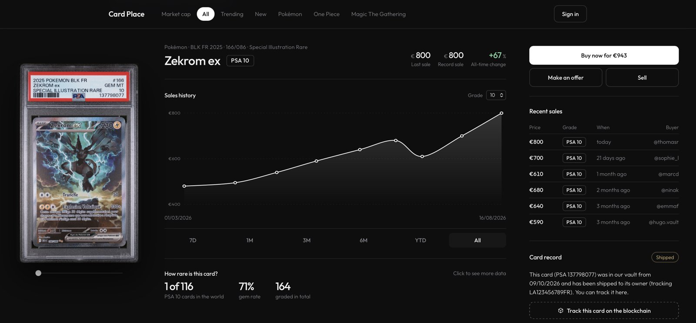
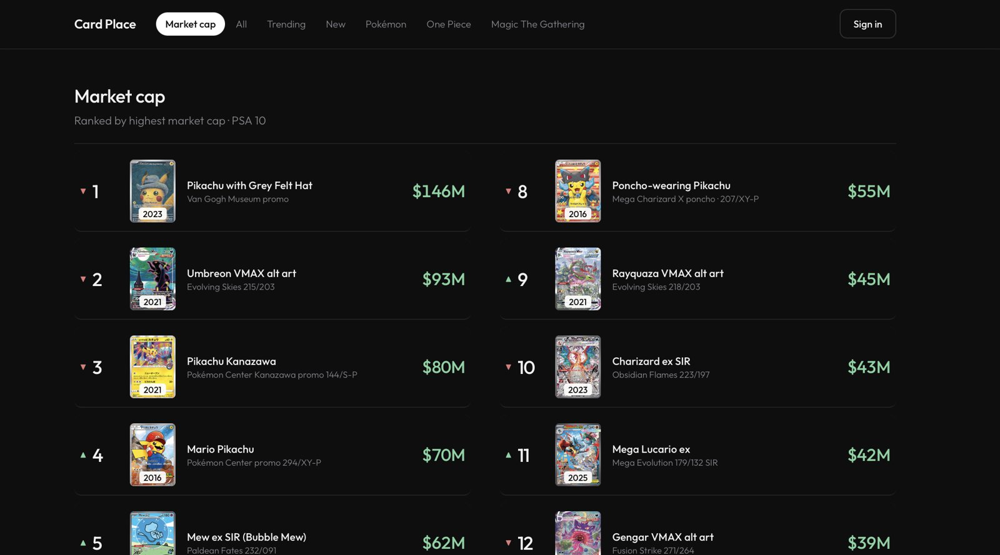
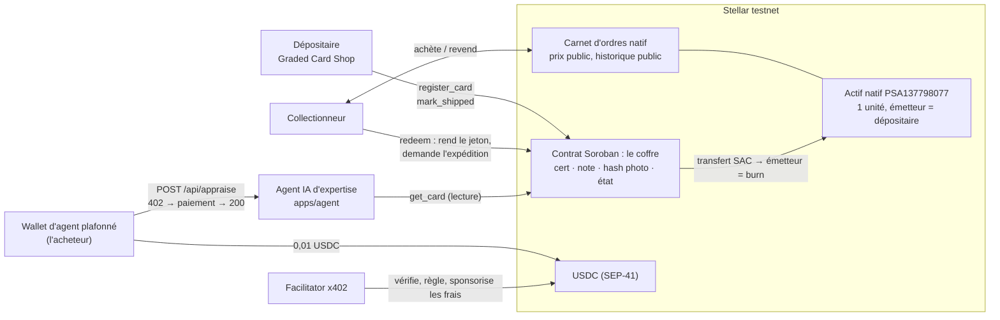

# Card Place — The first secure card exchange

**Un exchange sécurisé pour investir dans les cartes à collectionner comme dans une action** : carnet d'ordres, prix public, historique des ventes dans la blockchain, graphique, authentification au centre, et la possibilité de laisser la carte en coffre : l'article peut se vendre plusieurs fois tout en restant au même endroit.

## Le problème

Pour acheter une action ou une crypto aujourd'hui, vous avez le choix entre plusieurs plateformes sécurisées. Le spread est faible, le prix est le même chez tous les brokers, vous avez des graphiques, un historique clair, vous décidez en connaissance de cause, et en un clic vous devenez propriétaire de l'objet.

Les cartes à collectionner sont devenues un véritable investissement, et c'est un phénomène en pleine expansion.

Je suis collectionneur, mais aussi Lothin, cofondateur de [Graded Card Shop](https://gradedcardshop.fr) : j'achète et je vends des cartes gradées. Nous avons ouvert en février ; nous sommes aujourd'hui à 53 000 € de cartes vendues, sans publicité, uniquement en postant sur des plateformes comme Vinted et eBay.

Avant même de vendre en tant que professionnel, je le voyais en tant que collectionneur. Ce marché souffre de quatre maux :

1. **L'opacité des prix.** Il n'existe pas de prix de référence public. Les ventes se font en privé, sur des plateformes qui ne publient pas leur historique de façon claire, avec des écarts parfois de 10 % entre deux plateformes pour la même carte. L'acheteur ne sait pas s'il paie le juste prix, le vendeur ne sait pas s'il brade.
2. **L'état de la carte.** L'état influe sur le prix : une carte en mauvais état ne vaut pas le prix d'une carte en bon état. La notation est subjective, selon l'acheteur ou le vendeur. Beaucoup d'arnaques et de défauts intentionnellement dissimulés existent, et aucun organisme ne permet de valider l'état d'une carte brute.
3. **La contrefaçon.** Cartes falsifiées, mais aussi boîtiers scellés refaits, cartes retouchées avec l'IA. Les arnaques sont massives : chaque transaction oblige à refaire confiance à un inconnu.
4. **Le transport et le stockage.** Les assurances ne couvrent pas toujours le vol lors de l'envoi. Des cartes s'abîment en transit parce qu'elles sont mal emballées, par manque de pratique ou de connaissance. On constate aussi une hausse des cambriolages visant exclusivement les collectionneurs de cartes.

**Card Place vise toutes les cartes, mais attaque d'abord les cartes gradées.** Elles sont déjà authentifiées et notées par un tiers (PSA, PCA, BGS), scellées dans un boîtier, identifiées par un numéro de certificat unique. Leur prix est plus liquide et leur état est figé. C'est le marché le plus facile à sécuriser, et le point d'entrée naturel avant d'étendre le service d'authentification aux cartes brutes.

## Ce que fait le projet

La marketplace met en relation acheteurs et vendeurs, avec la possibilité de faire authentifier le produit si l'acheteur le demande, et des procédures claires données à chaque partie pour que la transaction se déroule convenablement. Une marketplace plus sûre, où il est possible de payer en monnaie fiat mais aussi en cryptomonnaie sur la blockchain Stellar (XLM, USDC).

Card Place joue le rôle de **séquestre** (escrow) : l'argent de l'acheteur est bloqué tant que la carte n'est pas arrivée et vérifiée, et la carte ne part que quand l'argent est bloqué. Ni l'acheteur ni le vendeur n'a à faire confiance à l'autre.

La marketplace fournit des données fiables qui permettent aux utilisateurs de prendre des décisions d'investissement plus pertinentes : un top des cartes les plus échangées en ce moment, tous TCG inclus, et des informations clés comme l'historique des ventes, le prix de référence et le graphique de performance.

Nous offrons au vendeur la possibilité de déposer sa carte dans un coffre-fort. Elle est alors représentée par **un actif Stellar natif** (code = numéro de certificat, 1 unité émise). Le jeton s'échange sur le carnet d'ordres natif, en 5 secondes, pour une fraction de centime, ce qui sécurise et facilite les transactions. Le physique ne voyage qu'une fois : quand le détenteur final appelle `redeem()`, rend le jeton et reçoit la carte.

**Phrase de démo :** je montre que trois piliers portent chaque échange : un smart contract Soroban qui tient la carte en coffre et bloque l'argent en séquestre ; x402 sur Stellar pour que les services se paient à l'appel en USDC ; et l'IA là où elle est utile, un agent de code pour construire et déployer le contrat, un agent d'expertise payé à l'appel, jamais dans la validation des transactions, qui reste du code déterministe.

### Le parcours utilisateur

Côté acheteur :

1. Je veux acheter une carte : je paie en monnaie fiat ou en cryptomonnaie. Mon argent est bloqué en séquestre.
2. Je peux négocier le prix demandé par le vendeur.
3. Je choisis de me faire expédier la carte, ou de demander une expertise et de transformer cet actif, sécurisé dans notre coffre-fort, en jeton Stellar.
4. Quand la carte est arrivée et vérifiée, le séquestre libère le paiement au vendeur.

Côté vendeur :

1. Je mets ma carte sur la plateforme au prix souhaité, puis j'accepte ou je refuse les offres des acheteurs.
2. Je n'expédie qu'une fois l'argent bloqué en séquestre.
3. Si je dépose ma carte en coffre, elle devient un jeton : je la revends sans l'expédier, autant de fois que je veux.

<p align="center">
  
  <br><br>
  
</p>

### Le produit : une marketplace data-driven

Chaque écran s'appuie sur une donnée que la chaîne rend publique et vérifiable :

| Écran | Ce qu'il montre | D'où vient la donnée |
|---|---|---|
| Fiche d'identité | série, extension, numéro, rareté, gradeur, certificat, note, photo | la fiche on-chain du contrat + le hash de la photo |
| Prix de référence, offre vs demande | meilleur prix d'achat, meilleur prix de vente, écart | le carnet d'ordres natif Stellar, public |
| Historique des ventes | chaque transaction, prix, date, note | les transactions du jeton sur le ledger, lisibles par tous |
| Graphique de performance | évolution du prix sur 7 j, 1 m, 1 an | le même historique, agrégé |
| Statistiques marché | plus bas, plus haut, volume 30 j, nombre de ventes | idem |
| Indice de confiance | certificat vérifié chez le gradeur, cohérence étiquette / fiche / photo, état visible | l'agent IA d'expertise, payé à l'appel |

### La sécurité, concrètement

- **Le séquestre.** Les USDC de l'acheteur sont verrouillés dans un contrat, pas chez le vendeur ni chez Card Place. La libération et le remboursement obéissent à des règles écrites dans le contrat : confirmation de l'acheteur, livraison confirmée, délai dépassé. Un programme sans IA écoute le transporteur et les événements on-chain et déclenche ces règles.
- **Aucune IA dans la validation des transactions.** Valider un paiement, libérer un séquestre, brûler un jeton : c'est du code déterministe, testé, lisible. Ajouter une couche IA sur des données financières ajouterait du risque, pas de la sécurité. L'IA sert ailleurs : pour construire et déployer le contrat (un agent de code branché sur Raven, le serveur MCP de Stellar, guidé par `AGENTS.md`), et pour l'expertise d'une carte, un service d'information payé à l'appel qui ne touche jamais aux fonds.
- **Seul le dépositaire peut créer le jeton.** L'actif est émis par le compte du coffre. Une carte qui n'est pas physiquement en coffre n'a pas de jeton, donc ne peut pas être vendue comme telle. Un faux, une photo volée ou un boîtier refermé ne produisent rien.
- **L'authentification est physique, à l'entrée en coffre.** Le dépositaire examine la carte et son boîtier, et confronte le numéro de certificat à la base publique du gradeur. Le jeton n'est émis qu'après.
- **La photo de référence est prise par le dépositaire**, pas fournie par le vendeur. Son hash on-chain garantit que personne ne remplace la photo après coup. C'est l'intégrité du dossier, pas l'authentification.
- **L'agent IA identifie la carte, il ne remplace pas l'authentification physique.** Il croise trois sources : la fiche publique du gradeur (PSA, PCA publient chaque certificat par numéro), l'étiquette du boîtier lue sur la photo, et la fiche on-chain. Si les trois concordent, la carte est identifiée et il note l'état visible. Si une seule diverge, revue humaine.
- **La chaîne rend le dossier infalsifiable ; la sécurité physique dépend du processus du dépositaire.** C'est vrai de StockX aussi. L'empreinte physique de la carte est la prochaine brique, décrite en fin de document.

## Sous le capot : ce qui tourne aujourd'hui sur le testnet

Un seul parcours on-chain, complet, exécuté avec une vraie carte du stock :

1. Le dépositaire authentifie la carte, la met en coffre et l'enregistre on-chain : certificat, note, hash SHA-256 de la photo. → `register_card`
2. Le jeton circule librement : paiement, carnet d'ordres, trustline = consentement du receveur.
3. Un agent IA, payé à l'appel en USDC via **x402 sur Stellar**, vérifie que la photo est celle du contrat, lit l'étiquette du boîtier, la compare à la fiche on-chain et au certificat publié par le gradeur, et évalue l'état.
4. Le détenteur rend le jeton et demande la sortie. → `redeem` (le SAC brûle le jeton)
5. Le dépositaire confirme l'expédition avec le numéro de suivi. → `mark_shipped`

## Pourquoi Stellar

Remplace Stellar par une base de données : il faudrait un intermédiaire de confiance pour tenir les soldes et publier les prix, des délais de règlement et des frais à chaque revente. Sur Stellar :

- **Un token n'est pas un contrat.** Une carte = code + émetteur, 1 unité. Émettre, c'est deux transactions.
- **Le marché est déjà dans le protocole.** Le carnet d'ordres natif échange la carte contre XLM ou USDC sans code de marketplace, et il est public : c'est la fin de l'opacité des prix.
- **Chaque vente est une transaction publique.** L'historique des prix d'une carte est vérifiable par n'importe qui, sans dépendre de la plateforme.
- **L'échange est atomique.** Jeton contre USDC dans une seule transaction : soit les deux jambes passent, soit aucune. Le séquestre ne sert que pour les mouvements physiques.
- **La trustline, c'est le consentement.** Personne ne reçoit une carte sans l'avoir acceptée.
- **Les frais permettent une carte à 10 €**, ce qui est impossible ailleurs économiquement.
- **Le fiat entre et sort par les anchors** (SEP-24, MoneyGram) : l'acheteur paie en euros, le ledger règle en USDC.
- **x402 sur Stellar** fait payer les agents dans la même monnaie que les collectionneurs, avec frais sponsorisés par le facilitator.

Le contrat ne fait que ce que le protocole ne sait pas faire : lier le jeton au certificat, tenir l'état physique, et gérer la sortie.

Honnêteté : [StockX](https://stockx.com) a prouvé le modèle carnet d'ordres + authentification pour les sneakers, sans blockchain. [Courtyard](https://courtyard.io) tokenise des cartes PSA sur Polygon. L'angle de Card Place est la niche européenne (PCA, PSA FR), un vendeur qui est lui-même le dépositaire, les cartes à bas prix que les frais d'ailleurs excluent, et le prix public comme produit. x402 existe aussi sur d'autres chaînes.

## Architecture



Lecture : le dépositaire écrit la fiche, le marché vit sur le carnet d'ordres natif, l'agent lit la fiche et se fait payer en USDC, le `redeem` brûle le jeton et déclenche l'expédition.

## Specs techniques

### Contrat `contracts/vault` (Rust, `soroban-sdk` 28, cible `wasm32v1-none`)

| Fonction | Auth | Entrées | Sortie | Effet |
|---|---|---|---|---|
| `__constructor(custodian)` | déploiement | `Address` | — | fixe le dépositaire (instance storage) |
| `custodian()` | aucune | — | `Address` | lecture |
| `register_card(asset_code, token, grader, cert, grade, description, photo_hash)` | dépositaire | `Symbol, Address, Symbol, Symbol, u32, String, BytesN<32>` | `Result<(), Error>` | crée la fiche, état `InVault`. Erreur `CardAlreadyRegistered` (1) |
| `redeem(holder, asset_code)` | détenteur | `Address, Symbol` | `Result<(), Error>` | transfère 1 unité du jeton (SAC) vers le dépositaire, état `RedeemRequested`. Erreurs `CardNotFound` (2), `InvalidStatus` (3) |
| `mark_shipped(asset_code, tracking)` | dépositaire | `Symbol, String` | `Result<(), Error>` | état `Shipped`, enregistre le suivi. Erreur `InvalidStatus` si pas `RedeemRequested` |
| `get_card(asset_code)` | aucune | `Symbol` | `Result<Card, Error>` | lecture publique |

**Stockage.** `Custodian` en *instance*. Chaque `Card(asset_code)` en *persistent*, TTL prolongé à chaque écriture (seuil 30 jours, cible 1 an). Pas de `Vec` ni de boucle : coût constant par appel.

**Fiche `Card`.** `token` (adresse SAC), `grader`, `cert`, `grade`, `description`, `photo_hash` (SHA-256 du recto), `status`, `redeemer: Option<Address>`, `tracking: Option<String>`, `registered_at` (ledger).

**Sécurité.** Transitions strictes `InVault → RedeemRequested → Shipped`. `redeem` exige l'auth du détenteur, qui couvre le sous-appel `transfer` du SAC : personne ne peut rendre le jeton d'un autre. Si le détenteur n'a pas le jeton, le transfert échoue et rien n'est modifié. 11 tests unitaires couvrent le cycle complet et chaque refus.

### Agent `apps/agent` (Node 22, ESM, Express 5)

| Route | Prix | Rôle |
|---|---|---|
| `GET /health` | gratuit | état du service |
| `GET /vault/:asset_code` | gratuit | fiche on-chain, lue par simulation RPC |
| `POST /api/appraise` `{ asset_code }` | 0,01 USDC via x402 | lit la fiche, vérifie l'empreinte de la photo, Claude lit l'étiquette, la compare à la fiche et au certificat du gradeur, évalue l'état et estime. La consultation du certificat chez le gradeur (API PSA, page PCA) est prévue à Lisbonne |

Un module par responsabilité : `config.js` (environnement), `vault.js` (lecture du contrat), `photos.js` (SHA-256), `appraise.js` (Claude, sortie structurée par schéma), `paywall.js` (x402 Stellar), `payer.js` (wallet d'agent plafonné), `server.js` (routes).

**x402 sur Stellar.** `@x402/express` + `@x402/stellar`, facilitator testnet hébergé par OpenZeppelin, réseau `stellar:testnet`, actif USDC SEP-41. Le client signe une entrée d'autorisation Soroban ; le facilitator reconstruit la transaction, sponsorise les frais et règle. Le client refuse de signer au-delà du plafond `AGENT_MAX_USD_PER_PAYMENT`.

**L'agent IA ne détient aucune clé Stellar et ne signe aucune transaction.** Il propose ; le détenteur et le dépositaire disposent.

## Déployé sur le testnet

| Quoi | Adresse / transaction |
|---|---|
| Dépositaire et déployeur | [`GBNZP4YND7GXOM26YNBOAXIMTEMKNHDX7CQ5VZOJ3VKW7HDJSQR3XK75`](https://stellar.expert/explorer/testnet/account/GBNZP4YND7GXOM26YNBOAXIMTEMKNHDX7CQ5VZOJ3VKW7HDJSQR3XK75) |
| **Contrat du coffre** | [`CDN5OOWTOYKEXMH5CDG7APQRQEHGFRKWQEAHQR5XR3643YOM2YEMEMRO`](https://stellar.expert/explorer/testnet/contract/CDN5OOWTOYKEXMH5CDG7APQRQEHGFRKWQEAHQR5XR3643YOM2YEMEMRO) |
| Déploiement | [`5833d9…978d1`](https://stellar.expert/explorer/testnet/tx/5833d98dd4230adee7f78feb8b34dcf8d8a190cb453c7b0dbf224c1ab25978d1) |
| Actif carte `PSA137798077` (SAC) | [`CASKFD5AFFRLUEW6YJUQRSTXJ7MQU7ZMUCMW254G4CR5QJ45Q5DYNVKH`](https://stellar.expert/explorer/testnet/contract/CASKFD5AFFRLUEW6YJUQRSTXJ7MQU7ZMUCMW254G4CR5QJ45Q5DYNVKH) |
| Collectionneur (détenteur) | [`GCR6HZKROPDQY3KZBSC27KKYEB7RAJRDWEIEUQYIXHUA6D6WOVXTWVHH`](https://stellar.expert/explorer/testnet/account/GCR6HZKROPDQY3KZBSC27KKYEB7RAJRDWEIEUQYIXHUA6D6WOVXTWVHH) |
| `register_card` (dépositaire) | [`246cf5…6d32c`](https://stellar.expert/explorer/testnet/tx/246cf5ebeebd77fe2176ef1fa584334a9c6f0e0387e8eed37d45a8ed7526d32c) |
| `redeem` (collectionneur, événement `burn` du SAC) | [`fb6a62…8977a`](https://stellar.expert/explorer/testnet/tx/fb6a6235c2cac014ed0e1e846945e1cf5b574b25458ba55e0e9946e0e398977a) |
| `mark_shipped` (dépositaire) | [`342db4…5ed3cf`](https://stellar.expert/explorer/testnet/tx/342db414c65cf3bf04648dde4fd87a280d883b2644c287fd64b733ada25ed3cf) |
| Paiement x402 réglé par le facilitator | [`4709b9…763c4`](https://stellar.expert/explorer/testnet/tx/4709b937d086eef100fe09bc760bde81f9d84887a7fff12f14beec9268e763c4) |

Le SHA-256 de `docs/psa-137798077-front.jpg` est `e274a654…0abfa`, inscrit on-chain.

## Reproduire

Prérequis : Rust + cible `wasm32v1-none`, [Stellar CLI](https://developers.stellar.org/docs/tools/cli) 28, Node 22, une identité testnet financée (`stellar keys generate moi --network testnet --fund`).

### 1. Contrat

```sh
cargo test                                   # 11 tests
stellar contract build                       # target/wasm32v1-none/release/card_vault.wasm

MOI=$(stellar keys address moi)
stellar contract deploy \
  --wasm target/wasm32v1-none/release/card_vault.wasm \
  --source-account moi --network testnet --alias vault \
  -- --custodian "$MOI"
```

### 2. La carte : un actif natif, un SAC, un détenteur

```sh
stellar keys generate collectionneur --network testnet --fund
COL=$(stellar keys address collectionneur)

stellar tx new change-trust --source-account collectionneur --line "PSA137798077:$MOI" --network testnet
stellar tx new payment --source-account moi --destination "$COL" \
  --asset "PSA137798077:$MOI" --amount 10000000 --network testnet          # 1 unité = 1 carte
stellar contract asset deploy --asset "PSA137798077:$MOI" --source-account moi --network testnet --alias card_psa137798077
```

### 3. Le cycle complet on-chain

```sh
# le dépositaire enregistre la carte (hash = sha256 de docs/psa-137798077-front.jpg)
stellar contract invoke --id vault --source-account moi --network testnet --send=yes -- \
  register_card --asset_code PSA137798077 --token CASKFD5AFFRLUEW6YJUQRSTXJ7MQU7ZMUCMW254G4CR5QJ45Q5DYNVKH \
  --grader PSA --cert '"137798077"' --grade 10 \
  --description '"2025 Pokemon BLK FR Zekrom ex #166 Special Illustration Rare"' \
  --photo_hash e274a6542ed20a6121176b169f09bf56c8a58ea62653109a9d553aa073a0abfa

# le collectionneur rend le jeton et demande l'expédition
stellar contract invoke --id vault --source-account collectionneur --network testnet --send=yes -- \
  redeem --holder "$COL" --asset_code PSA137798077

# le dépositaire confirme l'expédition
stellar contract invoke --id vault --source-account moi --network testnet --send=yes -- \
  mark_shipped --asset_code PSA137798077 --tracking '"LA123456789FR"'

# lecture publique
stellar contract invoke --id vault --source-account moi --network testnet -- get_card --asset_code PSA137798077
```

Sans `--send=yes`, l'appel est seulement simulé et n'atteint jamais le ledger.

### 4. L'agent IA et l'API x402

```sh
cd apps/agent
npm install
cp .env.example .env     # VAULT_CONTRACT_ID, X402_PAY_TO, X402_FACILITATOR_API_KEY, ANTHROPIC_API_KEY, AGENT_SECRET_KEY
```

- Clé facilitator testnet, gratuite : `curl https://channels.openzeppelin.com/testnet/gen`
- Le compte payeur a besoin d'une trustline USDC (`stellar tx new change-trust --line USDC:GBBD47IF6LWK7P7MDEVSCWR7DPUWV3NY3DTQEVFL4NAT4AQH3ZLLFLA5`) et de quelques USDC testnet ([faucet Circle](https://faucet.circle.com), réseau Stellar).

```sh
node scripts/x402-smoke.mjs                       # paiement x402 réel, sans IA : 402 → 200 + reçu
npm start                                         # serveur sur :3000
curl localhost:3000/vault/PSA137798077            # gratuit
node scripts/pay-and-appraise.mjs PSA137798077    # l'agent paie 0,01 USDC et reçoit l'expertise
```

Pour tester le paiement en XLM plutôt qu'en USDC (pas de faucet nécessaire), côté serveur `X402_ASSET=CDLZFC3SYJYDZT7K67VZ75HPJVIEUVNIXF47ZG2FB2RMQQVU2HHGCYSC X402_AMOUNT=1000000` et côté client `AGENT_ALLOWED_ASSET=<même adresse> AGENT_ALLOWED_ASSET_MAX=5000000`.

### 5. La page de la carte (marketplace)

Une page HTML sans framework ni build, dans `apps/web/`, en ligne sur **https://lothinnt.github.io/card-place/apps/web/** : menu par catégorie et classement Market cap, fiche de la Zekrom avec carte recto/verso, historique des ventes avec courbe, rareté, ventes récentes, dossier de la carte lu dans le contrat, prix d'achat en direct depuis le carnet d'ordres Stellar.

```sh
node apps/web/serve.mjs                           # http://localhost:8080/apps/web/
sh apps/web/seed-market.sh                        # place un ordre de vente et un ordre d'achat sur le DEX Stellar
```

- Le **dossier de la carte** est lu en direct via l'agent (`GET /vault/:code`), lancé avec `npm start` dans `apps/agent`. En ligne, sans agent, la page affiche « service offline » et le reste fonctionne.
- Le **prix d'achat** du bouton Buy now et les **transactions du jeton** sont lus en direct sur Horizon, l'API publique de Stellar, pour la paire `PSA137798077 / XLM`.
- L'historique des ventes, la population, le tableau du marché et le classement Market cap sont des données de démonstration dans `apps/web/data/`. Les images du classement viennent de TCGdex, pokemontcg.io et des archives Bulbagarden.

## Ce qui est réel, ce qui reste

| Dans ce dépôt, vérifié sur le testnet | À HackMeridian |
|---|---|
| Contrat du coffre déployé, cycle complet enregistré → rendu → expédié avec une vraie carte | La marketplace branchée : achat et vente depuis la page, historique des ventes indexé depuis les transactions du jeton |
| Page de la carte (`apps/web`) : fiche on-chain et carnet d'ordres lus en direct, courbe, population, indice de confiance | Plusieurs cartes, wallet connecté (Freighter), paiement fiat via anchor |
| Carte = actif natif + SAC, jeton brûlé au `redeem` | Plusieurs cartes réelles du stock, vente sur le carnet d'ordres en direct |
| Paiement x402 sur Stellar réglé on-chain par le facilitator | **Le contrat de séquestre** : `open` verrouille les USDC de l'acheteur, `release` paie le vendeur, `refund` rembourse après délai ou litige |
| Agent IA d'expertise : lecture on-chain, vérification SHA-256, sortie structurée. Contrat et tests construits avec un agent de code branché sur Raven | **Le programme de surveillance, sans IA** : écoute le transporteur et les événements on-chain, déclenche `release` ou `refund` selon les règles du contrat ; les litiges vont à un humain |
| Wallet d'agent plafonné côté client | L'agent qui achète pour un collectionneur dans sa limite de dépense ; vidéo de 30 s en plan B |

Ensuite : l'empreinte physique de la carte (scan haute résolution sous éclairage fixe, hash on-chain, re-scan à la sortie) ou un scellé NFC inviolable sur le boîtier, puis les cartes brutes via le service d'authentification et de notation à l'entrée en coffre, et le fiat par les anchors Stellar.

## Structure

```
contracts/vault/src/lib.rs    # le contrat du coffre, ~150 lignes commentées
contracts/vault/src/test.rs   # 11 tests
apps/agent/src/               # config, vault, photos, appraise, paywall, payer, server
apps/agent/scripts/           # x402-smoke.mjs, pay-and-appraise.mjs
apps/web/                     # single page : index.html, styles.css, app.js, data/, img/, serve.mjs, seed-market.sh
docs/                         # photos de référence de la carte
VISION.md                     # la vision hackathon (2000 caractères)
AGENTS.md                     # contexte pour les agents de code
```
